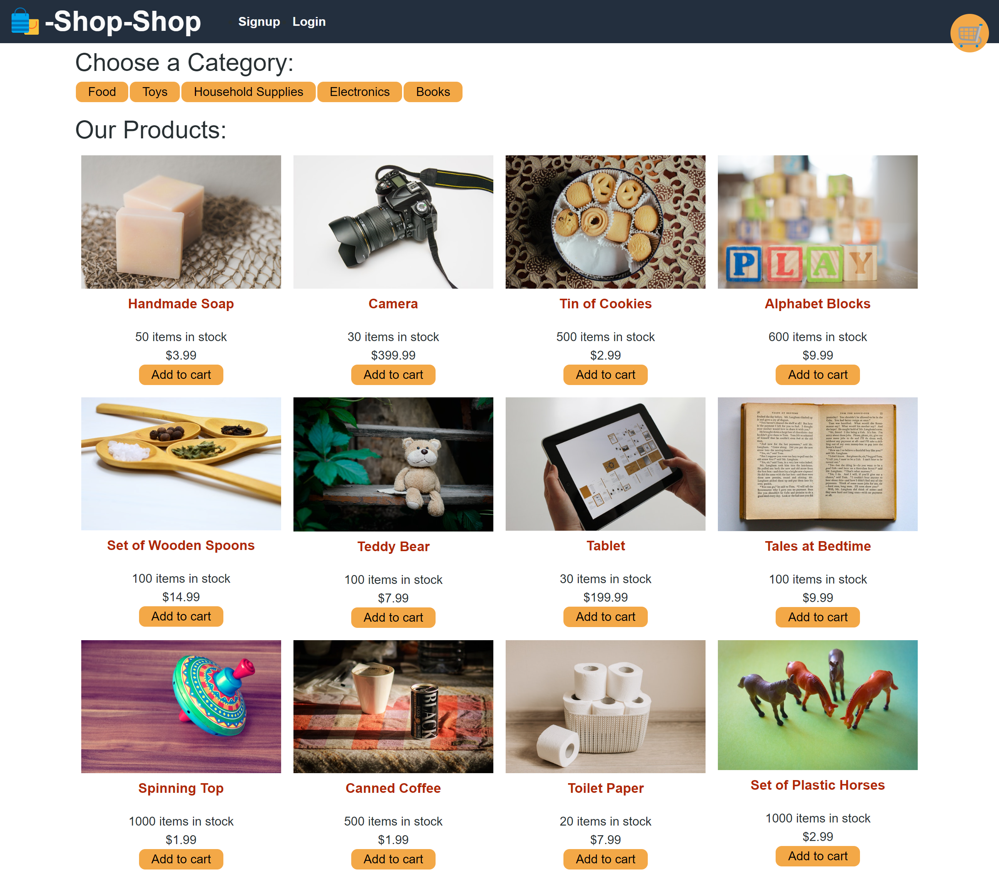

   # Redux Store
   ## malakhavam
   
   ## Description 
   
   This is a full stack e-commerce app that allows users to view items available for sale, create an account, add the items to their shopping cart, and order them using Stripe. It was refactored to use Redux instead of Context. The app uses MongoDB Atlas, Express, React, Node and Stripe for payment processing.
   
   ## Table of Contents  
   * [Installation](#installation)
   * [Screenshot](#screenshot)
   * [Contributors](#contibutors) 
   * [License](#license)
   * [Questions](#questions)
   
   
   ## Installation 
   
   The project was uploaded to GitHub at the following repository: https://github.com/malakhavam/redux-store  
   Deployed application access with the Heroku: https://malakhava-redux-store.herokuapp.com/    
   To install the project follow these steps: 
   * Clone the application from GitHub with: git clone [clone link from GitHub] 
   * From the root folder, install the dependencies with: npm install
   * To run the app locally use: npm run develop

   ## Screenshot

   
  
   ## Contributors

   N/A

   ## License

   MIT
  
   ## Questions
   
   If you have questions or you want to share comments, we will be glad to hear from you. Please contact me at malakhava@yahoo.com